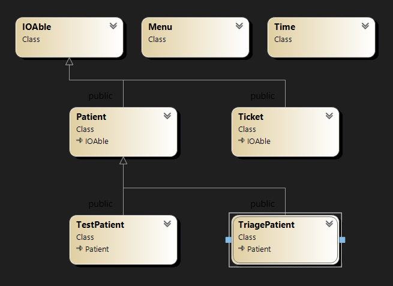

# Project: Ontario Pre-Triage Application for Healthcare Facilities

## Introduction
Through the development of the Ontario Pre-Triage Application for Healthcare Facilities, I have showcased a comprehensive range of C++ Object-Oriented Programming (OOP) capabilities. This application simulates the management of patient intake in a healthcare setting during a pandemic, emphasizing efficient, organized, and informative processes.

## Demonstrated C++ OOP Capabilities

### Encapsulation and Modular Design
- Organized complex logic into classes and modules, encapsulating functionality and providing a clear API.
- Managed the interdependencies of modules through carefully designed interfaces and class hierarchies.

### Inheritance and Polymorphism
- Implemented a base `Patient` class and derived specialized `TestPatient` and `TriagePatient` classes, showcasing inheritance and the use of polymorphic functions.
- Utilized virtual functions and pure virtual functions to create a polymorphic interface that allows for flexible treatment of different patient types.

### Dynamic Memory Management
- Practiced dynamic memory allocation and deallocation to manage patient data effectively, ensuring no memory leaks and optimal resource use.
- Designed classes that manage their own resources, following the Rule of Three, ensuring proper copy semantics for objects with dynamically allocated resources.

### Function Overloading and Operator Overloading
- Overloaded functions to provide customized behavior for patient registration and admission.
- Implemented operator overloading to enhance code readability and provide intuitive ways to interact with objects (e.g., streaming operators for I/O, comparison operators for patient handling).

### Template Programming
- Employed template programming to create generic solutions for common operations, like dynamically removing elements from an array.

### Exception Handling
- Ensured robust error handling and validation, maintaining application stability and preventing invalid state propagation.

### File I/O
- Engineered the persistence layer, enabling the application to save and load patient data from files, utilizing file stream classes and error checking.

## Use case

 In the event of a pandemic, measures must be taken to prevent the spread of the contagion. healthcare facilitys are required to screen patients and separate those in need of contagion testing from others. This process must be conducted in an orderly manner, informing patients of the expected wait time and notifying them when they can be admitted.

My task is to assist in completing the implementation of the Pre-Triage application, which will be used in such scenarios.

### The Pre-Triage Application
The application starts by displaying a simple menu with three options:
```Text
Ontario Pre-Triage Application for Healthcare Facilities
1- Register
2- Admit
0- Exit
>
```
#### Register
The register option is selected to screen patients before getting into the healthcare facility. The user can select betIen a contagion Test or Triage.

Contagion test is selected if the patient is at the healthcare facility for a contagion Test. In this case, the patient's name and OHIP number is entered and then a ticket will be printed with a call number and estimated wait time for admission for the patient.

If Triage is selected then in addition to the patient's name and OHIP number, the symptoms of the patient are entered. Then a ticket for Triage is printed with an estimated wait time for admission.

#### Admit
Admit is selected when the contagion Test area or the Triage section is ready to accept a patient. After selecting contagion or Triage, the patient with the next ticket in line will be called. Based on the time of the call, the average wait time for the next patient for that line up (contagion or Triage) will be updated.


## Utils Module
The `Utils` module is a versatile component of your project. It currently includes methods for retrieving system time. In debugging mode, the system time is simulated to facilitate testing and development.

The module is designed with extensibility in mind. You are encouraged to add custom methods and functionalities to this module or class as needed. This approach promotes code reuse and helps maintain consistent logic across your project.

The `Utils` module is instantiated globally, making it accessible to any module that includes “Utils.h”. It is available under the alias `U`. This global availability ensures that its methods can be conveniently used wherever needed in your project.

Remember to refer to the comments within the module for a deeper understanding of how it operates. These comments can serve as a valuable guide as you work with the Utils module or extend its capabilities.

## Startup

To initiate the project, I will develop two modules: `Time` and `Menu`. The `Time` module will manage the progression of time and add timestamps to appointment tickets. The `Menu` module drives the main user interface of the application.

## Time Module
The first step in tracking time for issued tickets is to implement a Time class.

The `Time` class is designed to:
- Read and write time in HH:MM format.
- Measure the passage of time.
- Calculate the estimated wait time.

The `Time` module stores time solely in minutes (one attribute for minutes). HoIver, it displays and reads time in the `HH:MM` format. For instance, if the `Time` object holds the value ***125***, it will display as ***02:05***. Similarly, if the time ***13:55*** is read by the Time object from istream, it stores ***835*** in the object (i.e., 13x60+55). Note that the `Time` object can also be used to measure the passage of time, and there is no limit to the number of minutes it can hold. It can exceed 24 hours if necessary.

> Note: ***125:15*** is a valid time that represents 125 hours and 15 minutes. Also, ***0:96*** is a valid entry and it is displayed as ***01:36***, which is ***1*** hour and ***36*** minutes.

Complete the implementation of the Time class with the following mandatory specs:  

### Attributes
The Time has one mandatory attribute to keep number of minutes. 

### Methods

```c++
Time& reset();  
```
This method resets the `Time` object to the current time using the `U.getTime()` method, which is available in the Utils module. It then returns a reference to the current object.

> Note: If the `seneca::debug` flag is set to true, or if the `U.setDebugTime()` method is called, the `U.getTime()` function will return a simulated system time. This feature is useful for debugging purposes and when submitting your work through the submitter program.

```c++
Time(unsigned int min = 0u); 
```
This constructor initializes a `Time` object. It sets the number of minutes held in the object to the value provided in the min parameter. If no value is provided, it defaults to zero, effectively setting the time to zero.

```c++
write
```
This method writes the time into ostream in the `HH:MM` format. If the hours or minutes are single-digit numbers, it pads them with a leading zero. For example, it formats the times as `03:02`, `16:55`, and `234:06`.


```c++
read
```
This method reads the time from istream in the `H:M` format. It ensures that the two integers (hours and minutes) are separated by a colon (`:`). If they are not, it sets the istream object to a failure state.

Please note that this function does not handle any invalid data. It simply follows these steps:

- Reads the integer for the hours using istream.
- Check the next character and verifies if it is `:` and discards is. If it is not, it sets the istream object to a failure state by executing the method: `istr.setstate(ios::failbit);`.
- Reads the integer for the minutes using istream.

- >Note: Do not clear or flush the istream as this method adheres to the istream standards. The caller of this function may check the istream state to ensure that the read operation was successful, if necessary.

```c++
operator unsigned int()const;
```
This operator overloads the cast to `unsigned int` for the `Time` class. If a `Time` object is cast to an unsigned integer, it will return the number of minutes held in the object.

```c++
Time& operator*= (int val);
```
This operator overloads the multiplication assignment `*=` for the `Time` class. It multiplies the number of minutes held in the Time object by val, then returns a reference to the current object.

```c++
Time& operator-= (const Time& D);
```

This operator overloads the subtraction assignment `-=` for the `Time` class. It calculates the time difference betIen the current Time object and the Time object `D` passed as an argument. Note that the difference can never be a negative value. If the result would be negative, it adds 24 hours (or 1440 minutes) to ensure the result is positive. Here are some examples:

- `23:00 -= 9:00` results in `14:00`.
- `18:00 -= 16:00` results in `2:00`.
- `1:00 -= 22:00` results in `3:00`. This is calculated as ((**1:00** + 24:00) - **22:00**).

See the illustration below:


```c++
Time operator-(const Time& T)const;
```
This operator performs the same calculation as the subtraction assignment `-=` overload, except that it does not have a side effect (i.e., it does not modify the current object).

It returns a new `Time` object representing the time difference betIen the current `Time` object and the `Time` object `T`.

### Helper Insertion and Extraction Overloads

```c++
operator<<
```
Overload the insertion operator to be able to insert a Time object into an ostream object as described in the write method.
```c++
operator>>
```
Overload the extraction operator to be able to extract data from an istream object into the Time object as described in the read method.

## Time Tester
The following program is a tester for the Time class.

[timeTester.cpp](ms1/timeTester.cpp)


## Menu Module
Create a Menu class that encapsulates a menu and provides selection functionality for the caller program.

### Suggested attributes
- A constant char pointer to hold the content of the menu to be displayed
- An Integer to hold the number of options in the menu
- An integer to hold the number of indetation tabs


```c++
 Menu(const char* menuContent, int numberOfTabs = 0);
```
This constructor is designed to initialize a `Menu` object. It takes two parameters: a pointer to a character string `menuContent`, and an optional integer `numberOfTabs` with a default value of `0`.

The constructor dynamically allocates memory to store the content pointed to by `menuContent` in the member variable `m_text`. It then scans `m_text` to count the number of newline characters (`\n`), which is used to determine the number of options in the menu.

The `numberOfTabs` parameter specifies the number of indentation tabs to be applied when displaying the menu. This allows for flexible formatting of the menu display. If not provided, no tabs will be applied by default.

```c++
 ~Menu();
```
Deallocates the dynamically allocated memory.

```Text
Copy and assignment
```
Makes sure the Menu can not be copied or assigned to another Menu object.

```text
display
```

The display method is responsible for presenting the `Menu` content to the user. It first outputs the menu options and a new line. Following the list of options, it prints:

```text
0- Exit
> _
```
This provides an option for the user to exit the menu and also indicates where the user can input their choice.

If the number of tabs attribute is not zero, the display method will indent the menu. Each tab corresponds to three spaces. This allows for adjustable formatting of the menu display.

Here are examples of how the menu would be displayed:

A menu with no indentation (i.e., `number of tabs` is `0`):

```text
Tester Options menu:
1- Option one
2- Option two
0- Exit
>
```
A menu with `number of tabs` set to`2`:
```text
      Tester Options menu:
      1- Option one
      2- Option two
      0- Exit
      >
```
In the second example, each line of the menu is indented by six spaces (two tabs * three spaces per tab) for a more structured visual presentation. This feature enhances the flexibility and user-friendliness of your menu system.

```c++
int& operator>>(int& Selection);
```
The member insertion operator first calls the display function and then receives the user's selection as an integer value. The integer reference **selection** argument is then set to this value and returned.<br />
Make sure that the entered value is validated as an integer (with no trailing characters) and also the value should be betIen 0 and the **number of options** in the menu.<br />
If the above conditions are not met, a proper error message should be displayed and re-entry requested(see below)

Assuming that the menu content is set to:```"Tester Options menu:\n1- Option one\n2- Option two\n3- Option three"``` , (hence the number of selections will 3) the **operator>>** should run like this:
```Text
Tester Options menu:
1- Option one
2- Option two
3- Option three
0- Exit
> abc
Bad integer value, try again: 1 (with a space after 1)
Only enter an integer, try again: -1
Invalid value enterd, retry[0 <= value <= 3]: 4
Invalid value enterd, retry[0 <= value <= 3]: 2
```
`2` is returned as user's selection.


## IOAble interface module

The core classes of the application.  The diagram below displays the core classes of the application and their relationship.



Create a class called **IOAble**.  This class is [an interface](https://intro2oop.sdds.ca/E-Polymorphism/abstract-base-classes#interface) and enforces the implementation of input and output methods to its derived classes.<br />
The IOAble class has only [2 pure virtual](https://intro2oop.sdds.ca/E-Polymorphism/abstract-base-classes#pure-virtual-function) methods:

## [Pure Virtual](https://intro2oop.sdds.ca/E-Polymorphism/abstract-base-classes#pure-virtual-function) Functions:

### write
This pure virtual function is for future ostream outputs.
It receives a reference of an ostream and returns a reference of an ostream. This function is incapable of changing the current object.
### read
This pure virtual function is for future istream inputs.
It receives a reference of istream and returns a reference of an istream.
### virtual destructor
This class also has an empty virtual destructor.

## Insertion and Extraction helper operator overloads.
### operator<<
Overload the insertion operator to be able to insert the information of an IOAble object into ostream using the IOAble::write function.
### operator>>
Overload the extraction operator to be able to extract information from an istream into an IOAble object using the IOAble::read function.


## The Ticket Module (implementation provided)

The Ticket class encapsulates a Ticket to be given to the patients when they arrive.

### Member Variables
#### Time m_time;
The time the Ticket was issued
#### int m_Number;
The ticket number; A sequential integer, starting from one and unique for each lineup.
### Member functions and constructor
#### Ticket(int number);
Constructs a Ticket by setting the **m_number** member variable
#### Time time()const;
A query that returns the time when the ticket was issued.
#### int number()const;
A query returning the number of the ticket
#### void resetTime();
Sets the Ticket time to the current time.
### Virtual function overrides
#### write
Inserts a ticket into the ostream to be displayed on the console or inserts comma-separated ticket number and time into ostream based on the ostream reference being `cout` or not.
#### read
Extracts the ticket number and time in a comma-separated format from istream.

## Utils Module
A function called "strcmp" is added to the Utils module that works exactly like the strcmp in the `<cstring>` header file to run the tester progam in main.cpp. 

Please copy and add it to your own Utils Module.


## The Patient Module

Develop an abstract base class named Patient, which inherits from the IOAble interface. The Patient class is designed to encapsulate the attributes and behaviors of a generic patient arriving at a healthcare facility. In subsequent stages of the project (specifically milestone 4), this Patient class will serve as a base class for two derived classes: TestPatient and TriagePatient. These derived classes will represent specific types of patients, each with their unique characteristics and needs. The Patient class, therefore, forms the foundation of our Pre-Triage management system in this healthcare context.

Please note that the Patient class is abstract, meaning it cannot be instantiated directly. Instead, it defines a common interface for its derived classes. This design promotes code reuse and polymorphism, key principles of object-oriented programming.

Remember, the purpose of this module is to provide a robust and flexible structure for managing two different types of patient types in the system. As you progress through the project, consider how the design of the Patient class and its derived classes can best meet this goal. 

The following are the mandatory properties of the patient class.

### Attributes of the Patient Class
The `Patient` class must include the following member variables and objects:

#### Patient name
A dynamically allocated C-string, represented by a character pointer variable, is used to store the patient’s name. This allows for names of varying lengths to be stored efficiently. 

> While the memory for the name attribute is dynamically allocated, I will operate under the assumption that a `Patient`'s name will not exceed 50 characters in length. If the input provided for the name attribute surpasses 50 characters, it should be silently truncated to the first 50 characters. This truncation should occur without raising any errors. This approach ensures that our program can handle a variety of input lengths while maintaining a consistent data structure size for the name attribute.

#### OHIP number
An integer attruibute is used to store the patient’s OHIP (Ontario Health Insurance Plan) number. This number should consist of exactly 9 digits, reflecting the standard format of OHIP numbers.
#### Ticket
A Ticket object is used to represent the patient’s ticket for the lineup. This object encapsulates all relevant information about the patient’s position in the queue, such as their arrival time and priority level.


### Constructor 
Instantiate a Patient object by providing a ticket number (an integer). This ticket number will be utilized to initialize the Ticket member attribute.

### Copying and assignment.
Ensure that a Patient object can be safely copied or assigned to another Patient without encountering memory leaks or any associated issues.

### Destructor
Implement a destructor for the Patient class that effectively deallocates any dynamically allocated memory, thereby preventing memory leaks.


### Member functions
#### char type()
Create a pure virtual function called **type** that returns a character and is incapable of modifying the current object.
In future derived objects, this function will return a single character that identifies the type of the patient (Contagion test patient or Triage patient).


#### Operator== Overloads
##### Patient Comparison to a Character
Overload the `operator==` to compare the current object with a single character (the right operand). Return true if the values returned by the type function of this patient and the provided single character are identical. Note that this operator should not modify the current object.

##### Comparing to Another Patient
Overload the `operator==` to compare the current object to another patient. Return true if the type of the current patient is the same as the type of the other patient; otherwise, return false. This operator should not have the ability to modify either the current object or the right operand.

#### Setting the Patient's Arrival Time
Implement a modifier method named `setArrivalTime` within the Patient class. This method sets the time of the patient's ticket to the current time. It does not take any parameters and does not return any value.

#### Getting the Patient's Arrival TIme
Create a query method named `time` to retrieve the time of the patient's ticket and return it.

#### Patient's Ticket Number
Establish a query method named `number` that returns the number associated with the patient's ticket.

### Cast Overloads
#### Boolean
When a patient is casted to a boolean, return true if the Patient is in a valid state; otherwise, return false.

#### Const Character Pointer
If a patient is casted to a constant character pointer, return the address of the patient's name.


### pure virtual function overwrites.

### Writing Patient Information into `ostream`
This method inserts information into the ostream reference in three different formats based on the instance of the ostream. For `cout`, it inserts detailed information suitable for printing like a ticket in multiline format. For `clog`, it presumes a list is being printed, and therefore the information is inserted in a linear format suitable for a list. For any other object, it will insert the values in a comma-separated format suitable for saving in a file.

Overwrite the `write` method to insert patient information into the `ostream` as follows:

1. If the patient is being inserted into the `clog` object, the information is displayed in a linear format as follows:

   - If the patient is in an invalid empty state 
      - Insert "Invalid Patient Record".
   - Otherwise
      - Insert the name of the patient in 53 spaces, left-justified, padded with '.' characters.
      - Insert the OHIP number.
      - Insert the ticket number in 5 spaces, right-justified.
      - Insert a space.
      - Insert the ticket time.

2. If the patient is being inserted into the `cout` object, the information is inserted as follows:

   - If the patient is in an invalid empty state 
      - Insert "Invalid Patient Record" and go to a newline.
   - Otherwise
      - Insert the member ticket object.
      - Insert a newline character.
      - Insert the patient's name.
      - Insert ", OHIP: ".
      - Insert the OHIP number.
      - Insert a newline character.
      - Return the ostream.

3. If the patient is not being inserted into the `cout` or `clog` object, the information is presented in a comma-separated value format:

   - Insert the following values into the ostream in a comma-separated format. After the values are inserted, add a single "comma", and then call the write function of the member ticket object. Finally, return the ostream.

   - The sequence of values inserted into the ostream is as follows:

      ```Text
      returned value of the type() function
      ','
      name of the patient
      ','
      OHIP number
      ','
      ```
     and then insert the ticket.


### Reading Patient Information from `istream`
Overwrite the read method to extract patient information from the `istream` as follows:

If the information is being extracted from `cin` (user input over the console), the following actions are taken:

- Display the prompt: "Name: ".
- Extract the name of the patient from the `istream` up to 50 characters or the newline character into a local Cstring of 51 characters using `istream`'s `get`.
- Copy the extracted name into dynamically allocated memory pointed by the name member variable, ensuring the name pointer is deleted before the allocation to prevent memory leaks.
- Extract and ignore all characters up to and including the newline character.
- Display the prompt: "OHIP: ".
- Extract a 9-digit OHIP number from the istream. Validate it, ensuring it is betIen 100000000 and 999999999. Use the same error message format as the Menu item selection.
- Return the istream reference at the end.

Execution example:

```Text
Name: John Doe
OHIP: abc
Bad integer value, try again: 100
Invalid value entered, retry [100000000 <= value <= 999999999]: 123123123
```

If the information is **not** being extracted from `cin`, presuming it is being read from a file, the information should be read in comma-separated format as follows:

- Extract the name of the patient from the `istream` up to 50 characters or a comma character into a local Cstring of 51 characters.
- Copy the extracted name into dynamically allocated memory pointed by the name member variable, ensuring the name pointer is deleted before the allocation to prevent memory leaks.
- Extract and ignore all characters up to and including a comma character using istream's ignore.
- Extract an integer from the istream into the OHIP member variable.
- End the extraction by calling the read method of the patient's ticket.
- Return the istream reference at the end.

If, in any case, the istream fails to read the information, ensure that any dynamically allocated memory held by the name attribute is deleted, and the pointer is set to nullptr.


## Advance the development of the Pre-triage application by incorporating the `test patient` and `triage patien` modules into the system.

## The TestPatient module
This module has one integer global variable called **nextTestTicket** that is initialized to **one**.  This global variable will be used to determine what is the ticket number of the next contagion test Patient.  Each time a new **TestPatient** object is created the value of the **nextTestTicket** will be increased by **one**.  The scope of the global **nextTestTicket** variable is only the **TestPatient** module.

The **TestPatient** class is publicly derived from the **Patient** class. The **TestPatient** class does not add any member variables or properties to the **Patient** module.

The **TestPatient** class has one **default constructor**, implements the pure virtual **type()** function and re-implements the four **read and write** functions of the base class **Patient** as follows:

### Default Constructor
The default constructor passes the **nextTestTicket** global variable to the **constructor** of the base class **Patient** and then it will increase the value of **nextTestTicket** global variable by **one**.

### the type() virtual function
This function only returns the character **'C'**;

### write virtual function override.
If the ostream is cout it will insert **"Contagion TEST"** into the **ostream** object and goes to **newline**. 

Then it will call the **write()** function of the base class **Patient**.

At end it will return the **ostream** reference.

### read virtual function override. 
It will call the read function of the base class **Patient**.

If the istream is not cin (reading from a file) then it should set the **nextTestTicket** to the ticket number of this patient + 1. This will make sure the ticket numbers are correctly restored with records are being read from a file.

Then it will return the **istream** reference.

### Destructor
This class does not need a custom destructor.

## The TriagePatient Module
This module includes a single integer global variable called `nextTriageTicket` initialized to `one`. This global variable determines the ticket number of the next triage Patient. Each time a new TriagePatient is created, the value of `nextTriageTicket` increases by one. The scope of the global `nextTriageTicket` variable is limited to the `TriagePatient` module.

The `TriagePatient` class is publicly derived from the `Patient` class. The `TriagePatient` class introduces one character pointer member variable to dynamically hold the symptoms of the arriving patient for the triage center.

The `TriagePatient` class includes a default constructor, implements the pure virtual type() function, and re-implements the two read and write virtual functions of the base class `Patient`. It adheres to the rule of three in derived classes to properly manage the dynamically allocated memory of the class and the base class during copying and assignment.

### Symptoms Character Pointer Member Variable
Create a character pointer member variable to point to a dynamically allocated Cstring holding the list of symptoms of the `TriagePatient`. Although this characters Cstring is held dynamically but I will make sure it will not be more than 512 character. In such case where the lenght of the data exceeds 512, the data will be truncated and the rest of it will be silently ingnored. 


### Default Constructor
The default constructor initializes the character pointer member variable to null, passes the `nextTriageTicket` global variable to the constructor of the base class `Patient`, and then increases the value of `nextTriageTicket` by `one`.

### the type() virtual function
This function returns the character **'T'**;

### write virtual function override.
This function inserts the patient information into different instances of `ostream`.

If the ostream reference is `cout`, it prints a "TRIAGE" label, inserts the patient, and displays the symptoms. If it is `clog`, it only prints the patient information in a linear format with no symptoms. If it is neither `cout` nor `clog`, it inserts the information in a comma-separated format.

- If the `ostream` reference is `cout`
   - Inserts the word `"TRIAGE"` into the `ostream` and goes to a newline.
- Calls the patient's write method.
- If the `ostream` reference is `cout`
   - Inserts `"Symptoms: "` into the `ostream`.
   - Inserts the patient's symptoms into the `ostream`.
   - Goes to a newline.
- If the ostream reference is not `clog` (clog is only used for linear printouts)
   - Inserts a "`,`" and then the patient's symptoms.

The function ends by returning the ostream reference.

### read virtual function override. 
This function extracts patient information from different instances of `istream`:

- Console entry via `cin`
- Comma-separated values entry via any other `istream` objects.

It performs the following steps:

- Deletes the memory pointed to by the symptoms member variable.
- Calls the Read function of the base class `Patient`.
- If the `istream` reference is not `cin`:
   - Ignores the comma character.
   - Reads the symptoms of the patient into a local Cstring character array, up to 511 characters or until a newline `('\n')` is encountered.
   - Allocates memory and copies the local symptoms Cstring into the allocated memory.
   - Sets the `nextTriageTicket` global variable to the return value of the `number()` member function of the `Patient` class plus `one`.
- Otherwise:
   - Displays the prompt `"Symptoms: "`.
   - Reads the symptoms into the local Cstring, up to 511 characters.
   - Allocates memory and copies the local symptoms Cstring into the allocated memory.

In case the `istream` fails, it deletes the dynamically allocated memory and sets the pointer to nullptr.

The function concludes by returning the istream reference.

### Destructor
Deletes the memory pointed by the [symptoms member variable](#symptoms-character-pointer-member-variable)

## PreTriage Module

To complete the implementation of the final project, implement a module called Pre-Triage.  This module creates a lineup of patients and issues tickets for them as they arrive at the healthcare facility.  Each patient in the lineup will be either a contagion Patient or a Triage Patient and will receive a ticket with a number that will be called when they are being admitted to either the contagion test centre or Triage Centre.

### Overview of The PreTriage Module Execution

The module gets instantiated by loading the data file holding the patients' records that are already in the lineup. This data file is created by the PreTriage Module at exit time. This makes this module a stateful module, which means when the module exits, it saves all the patients' information into a data file so that later, it can restart the application in the same state as the last execution (by loading the data file).

If the data file does not exist or it is not readable, the module assumes that this is the first time it is being executed; and no patients are in the lineup.

After loading the data, the result of the loading is reported and then the main menu of the application is displayed. See below:

If there is no data file or a data file with no Patient records:
```text
Loading data...
No data or bad data file!

General Healthcare Facility Pre-Triage Application
1- Register
2- Admit
0- Exit
>
```
If there is a data file with patient lineup records:
```text
Loading data...
16 Records imported...

General Healthcare Facility Pre-Triage Application
1- Register
2- Admit
0- Exit
>
```
The user can then select either register or admit.

> **Register**: This option is selected when a patient arrives at the healthcare facility. Afterwards, the program will display another menu to select the type of Patient and receive the patient's information. The Patient is then added to the lineup and a ticket is printed. 

> **Admit**: This option is selected when either the Contagion or Triage centre is ready to accept the next patient. Afterwards, the program will display another menu to select the type of Patient and shows the information of the next patient in line. 

> **Exit**: When this option is selected, the program exits saving the information of the patients in the lineup so it can be reloaded the next time.  See below:


```text
Loading data...
16 Records imported...

General Healthcare Facility Pre-Triage Application
1- Register
2- Admit
3- View Lineup
0- Exit
> 0
Saving lineup...
7 Contagion Tests and 9 Triage records Ire saved!
```
## PreTriage constant maximum lineup value
### Maximum Number of patients
Add a constant value to be used for the maximum number of patients in the lineup (Contagion and Triage combined). Set this value to `100`.

## PreTriage class 
### Attributes:
#### Wait times
Add two Time object attributes to the class to keep track of the average wait time for the Contaigen test and the Triage patients separately.
#### Patient Lineup.
Create an array of pointers to `Patient` objects. The size of this array should be set to the `maximum lineup value` constant. These pointers should be `nullptr` when the `PreTirage` class is instantiated. 

> When Patients arrive, they will be dynamically instantiated and their addresses will be kept in the elements of this array. See `register()` method

#### Data Filename
A C-string to hold the path and name of the data file.

#### Number of patients in the lineup
Create an attribute to hold the actual number of patients in the lineup. This number can not exceed the maximum lineup value.
### Constructor
A `PreTriage` class is instantiated using the data file name. This data file name is stored in the data filename attribute for load and save purposes.
The constructor also initializes the two Time attributes, Contagion test and Triage, to 15 and 5 respectively.
> These Time values may be overwritten by the corresponding values in the data file, if present.
The constructor then loads all the data from the data file, if possible.
### Destructor
- Saves the data. 
- Iterates through the patient lineup and deletes the elements one by one.
- If there are any other dynamically allocated memory, it will delete them as Ill. 

### Private Methods

#### getWaitTime  (Query)
Receives a constant Patient Reference and returns the total estimated wait time for that type of Patient (contagion or Triage) as follows:

- Find the number of Patients in the lineup that match the type of the received Patient Reference. 

- Returns the product of estimated wait time (for that type of patient) to the number of patients found.
> This method does not change the state of the class. 

#### setAverageWaitTime (Modifier)
Receives the reference of the admitting patient and adjusts the average wait time of that type of patient based on the admittance time of the patient.

Modify and set the value of the average wait time  of the corresponding patient using the following formula:  
```text
CT: Current Time
PTT: Patient's Ticket Time
AWT: Average Wait Time (Contagion or Triage)
PTN: Patient's Ticket Number
AWT = ((CT - PTT) + (AWT * (PTN - 1))) / PTN
```

#### indexOfFirstInLine   (Query)
Receives a character representing the type of patient (`C` for Contaigen, `T` for Triage).

Finds the index of the first patient in line that matches a specified type.

This function iterates over the lineup array of pointers from the beginning. For each patient, it compares the patient's type with the specified type (using overloaded operator==). If a match is found, the function returns the found index. If the function iterates over the entire lineup without finding a match, it returns -1

#### load (Modifier)
Loads the average wait times and the patient records from the data file and stores them in the lineup array of pointers.
- print `"Loading data..."`, goto newline
- read the contagion test average wait time from the data file
- ignore the comma
- read the triage average wait time from the data file
- ignore the newline
- pseudo-code:
```text
Create a local patient-pointer
In a loop from 0 to the maximum number of patients (or up to when reading fails)
    read the first character and ignore the comma
    if the character is 'C'
       in the current patient-pointer element instantiate a Contagion Test Patient
    otherwise, if the character is 'T'
       in the current patient-pointer element instantiate a Triage Patient
    endif
    If Instantiation successful
       Read the patient information from the file
       Add the local pointer value to the patient lineup array
       increase the lineup size
    end if
end loop
```
- At the end print these messages and go to newline:
- if there are still records left in the file, print the following warning:  
'"Warning: number of records exceeded"' and then print the maximum number of records, for example:
```text
Warning: number of records exceeded 100
```
- if no records Ire read print `"No data or bad data file!"` otherwise, print `"###  Records imported..."` (### is replaced with the number of records read)

- Examples:
```text
Loading data...
Warning: number of records exceeded 100
100 Records imported...
```
```text
Loading data...
16 Records imported...
```
```text
Loading data...
No data or bad data file!
```
#### save (Query)
- Opens the data file for output.
- Inserts "Saving lineup...", into cout and goes to newline
- Inserts the average Contaigen Test and Triage wait times, comma-separated into the data file and goes to newline.
3. Iterates through the lineup array of Patient pointers
   - Inserts them into the data file and goes to newline
4. Inserts the number of records saved for each type of patient into cout and goes to newline
> See the `Exit` option description for sample output.

#### register (Modifier)
Registers a new patient:

Create a Menu object for a sub-menu for patient type selection with one indentation (1 tab) as follows to be displayed later.
```text
   Select Type of Registration:
   1- Contagion Test
   2- Triage
   0- Exit
   >
```
- If the lineup size has reached the maximum number of patients, print `"Line up full!"`, go to a new line and terminate the function
- display the sub-menu and receive the selection
- if the selection is 1, in the next available lineup pointer instantiate a Contagion Test Patient
- if the selection is 2, in the next available lineup pointer instantiate a Triage Patient
- if the selection is 0, terminate the function
- set the patient's arrival time 
- print: `"Please enter patient information: "`
- extract the patient from cin
- go to newline
- Print the ticket
   - print: `"******************************************"`
   - go to newline
   - insert the patient into cout
   - print: `"Estimated Wait Time: "`
   - print the return value of **getWaitTime** for the patient.
   - go to newline
   - print: `"******************************************"`
   - go to newline twice
- increase the lineup size.

#### admit (Modifier)
Calls the next patient in line to be admitted to the contagion test centre or Triage centre

Create a Menu object for a sub-menu for patient type selection with one indentation (1 tab) as follows to be displayed later.

```text
   Select Type of Admittance:
   1- Contagion Test
   2- Triage
   0- Exit
   > 0
```

- display the sub-menu and receive the selection to determine the type of patient to admit.
- if the selection is 1, the type is 'C'
- if the selection is 2, the type is 'T'
- if the selection is 0, terminate the function
- find the index of the next patient in the line for the type (use **indexOfFirstInLine** method)
- if no patient is found, print `"Lineup is empty!\n"` and terminate the function
- go to newline
- print: `"******************************************"`
- go to newline
- print: `"Call time [H:M]"`
- go to newline
- print: `"Calling for "`
- insert the patient into cout
- print: `"******************************************"`
- go to newline twice
- set the average wait time for the patient (using setAverageWaitTime method)
- remove the patient from the lineup using the `removeDynamicElement` function template.

#### lineup (Query)
Prints a report on patients currently in the lineup.

- display a sub-menu with one indentation as follows and get the user's selection.
```text
   Select The Lineup:
   1- Contagion Test
   2- Triage
   0- Exit
   >
```
- print the following header:
```text
Row - Patient name                                          OHIP     Tk #  Time
-------------------------------------------------------------------------------
```
- iterate through the lineup array of patient pointers and insert only the type of patents selected by the user into clog.
- if there are no patients in the lineup print `"Line up is empty!\n"` instead.
- close the list by printing:
```text
-------------------------------------------------------------------------------
```

### Public method
The following is the member of the Pre-Triage class. 

#### run (Modifier)
Runs the PreTriage main application.

Create the Main system menu as follows
```
General Healthcare Facility Pre-Triage Application
1- Register
2- Admit
3- View Lineup
0- Exit
>
```
And get the user's selection.
1. display the menu and get the selection
2. if the selection is 0, quit the method
3. if the selection is 1 call the **register** method
4. if the selection is 2 call the **admit** method
5. if the selection is 3 call the **lineup** method
6. go back to 1


